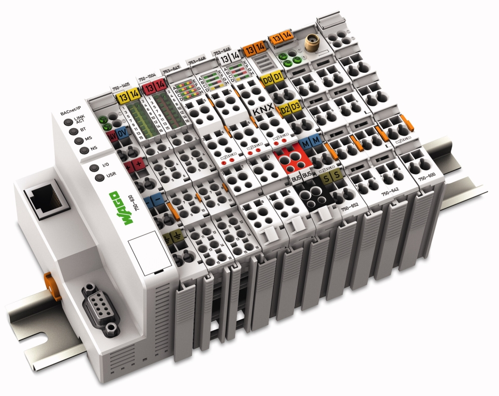
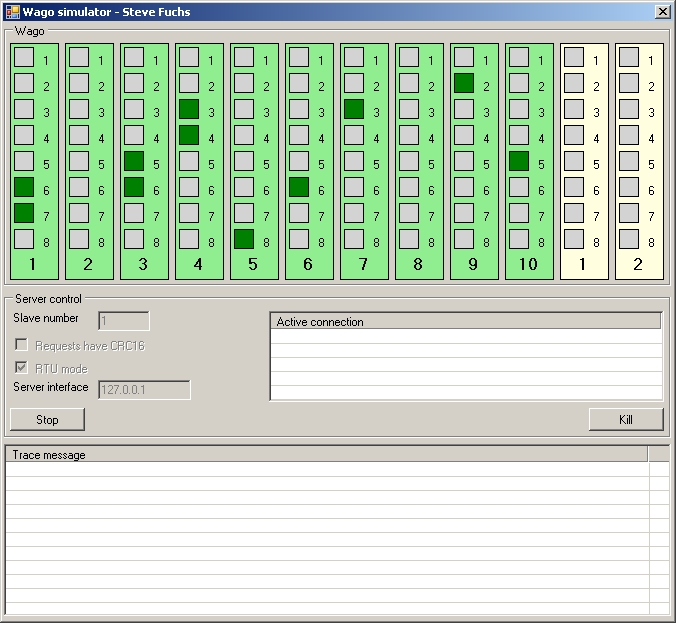
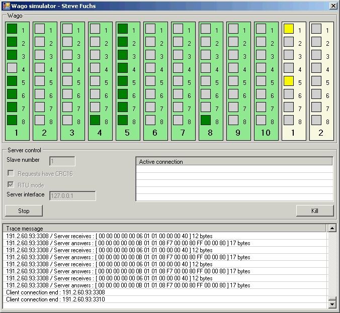

Projet permettant de simuler le fonctionnement d&rsquo;un ensemble « simple » de modules Wago I/O sur Ethernet.

Basé sur le protocole ModBus.

L&rsquo;application présente 10 modules d&rsquo;entrées et 2 modules de sorties avec une capacité d&rsquo;étendre cela.

L&rsquo;utilisateur peut modifier l&rsquo;état d&rsquo;une entrée en cliquant dessus, visualiser l&rsquo;état des sorties, voir les connections actives et les trames échangées avec les clients.

L&rsquo;idée générale était de simplifier le développement de solutions interagissant avec ces modules Wago I/O.

