Site Internet sur le Karaté réalisé en 2003, non maintenu à ce jour mais toujours actif et visité.

Un des mes premiers sites dépassant 4 pages&#8230; Développé en PHP3 avec une petite animation Adobe Flash pour découvrir comment faire.

Le lien (tant que celui-ci est encore valide) est <a class="external free" href="http://www.karatedo.free.fr/" rel="nofollow">http://www.karatedo.free.fr/</a>

L&rsquo;interface date beaucoup maintenant 🙂 La première page du site ressemble à la suivante :

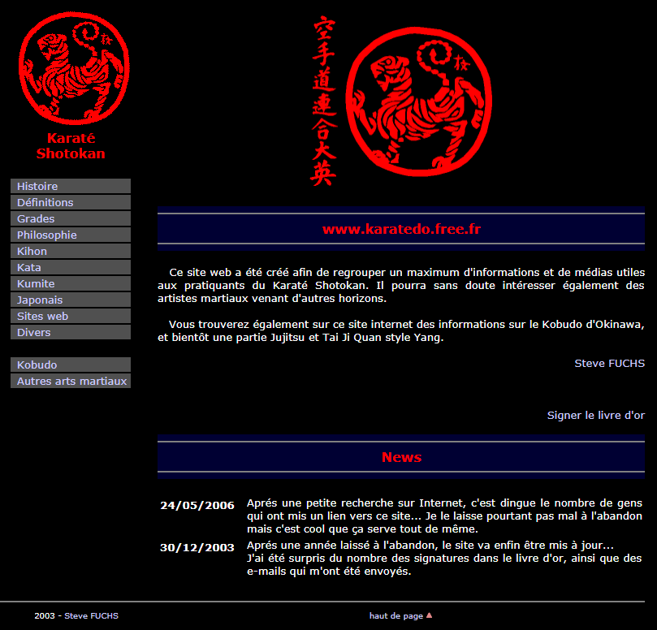

Statistiques d&rsquo;accès :

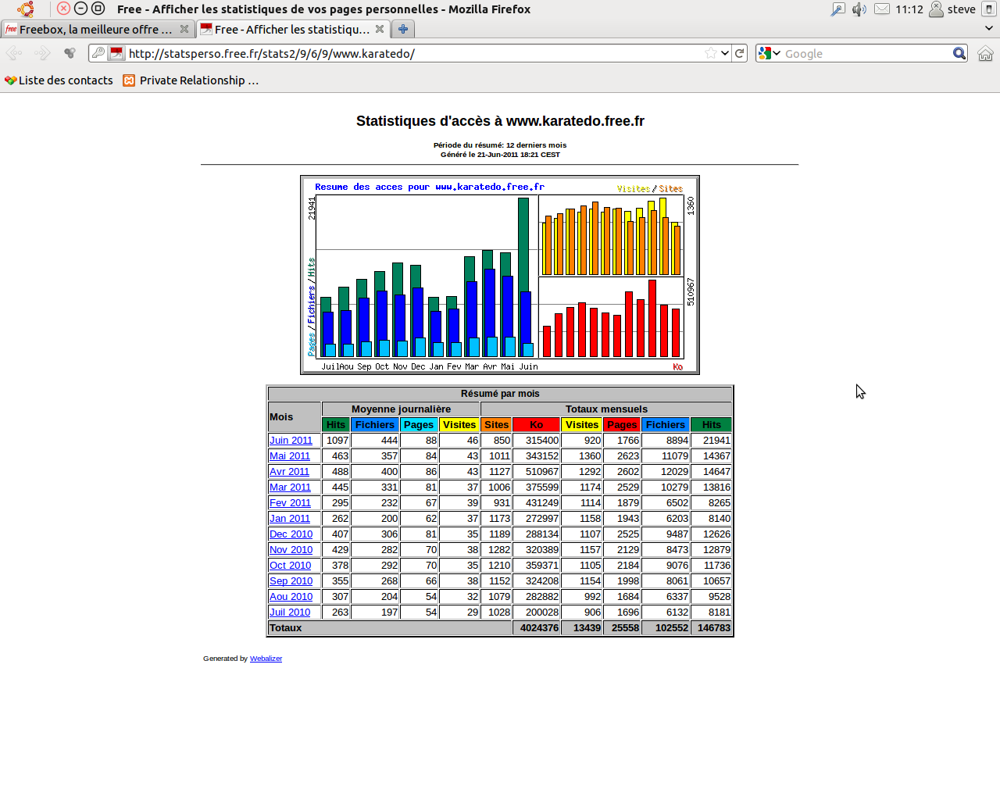

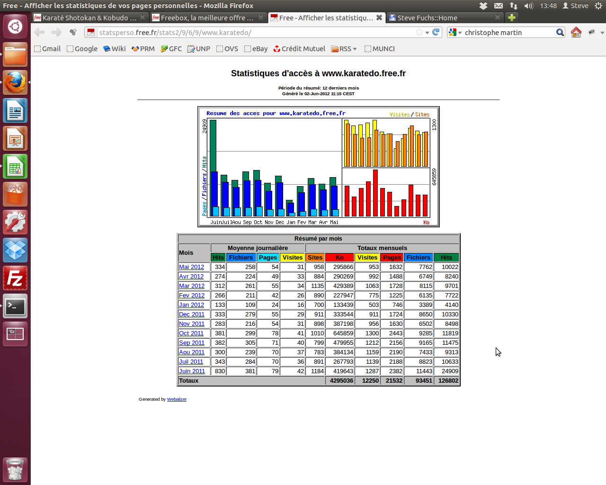

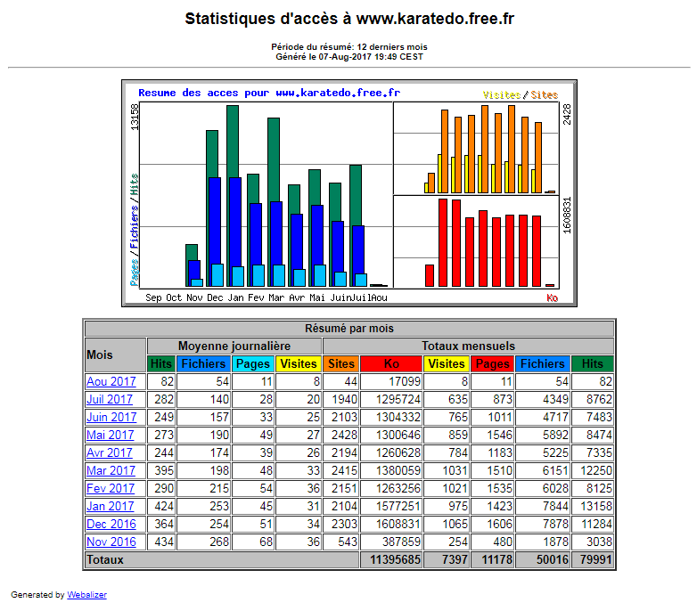

Signatures dans le « livre d&rsquo;or » :

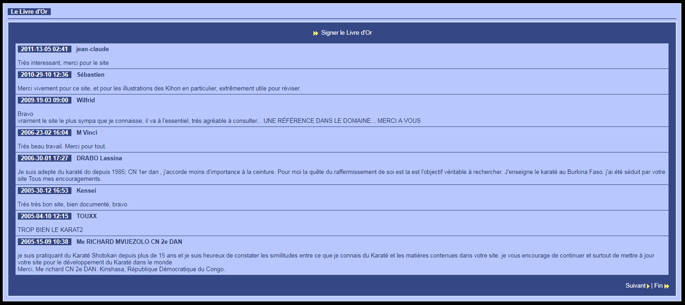

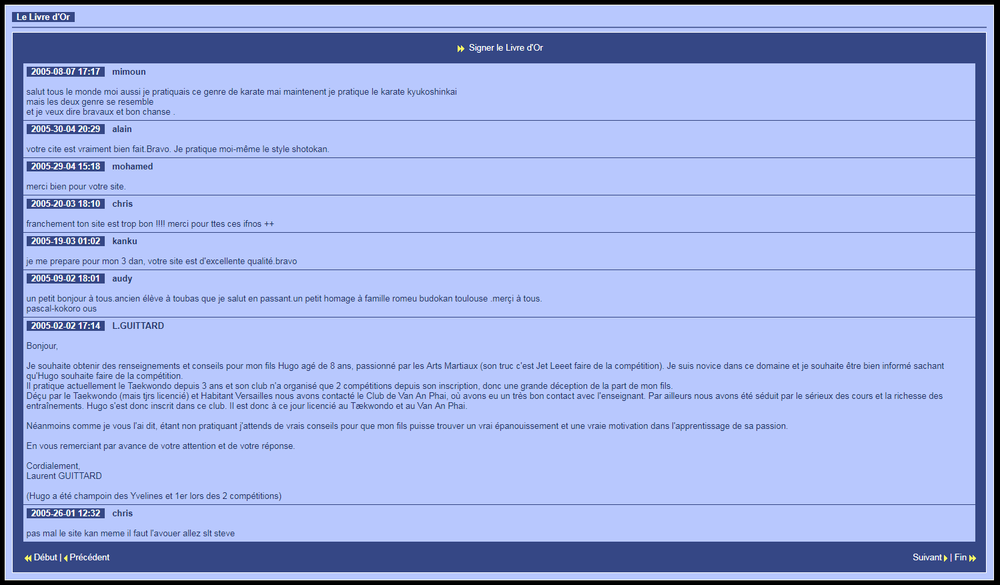

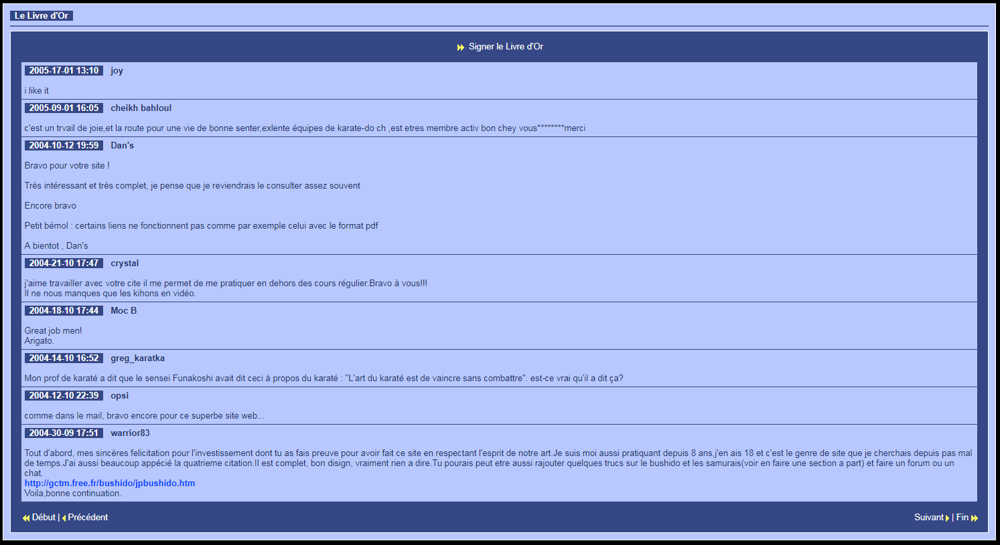

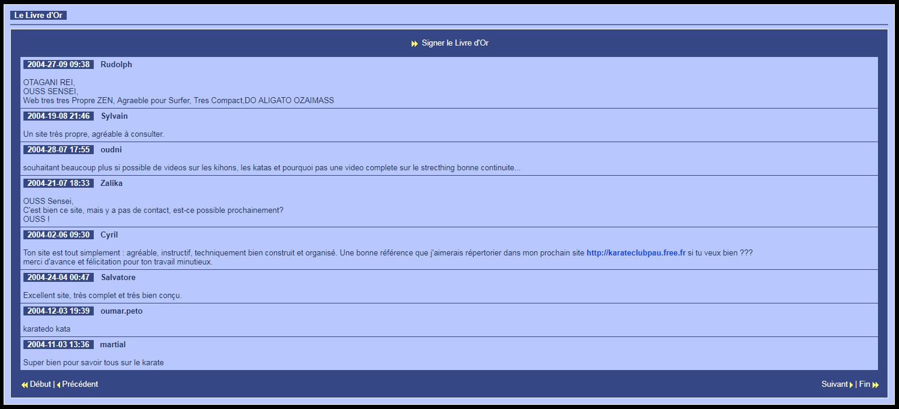

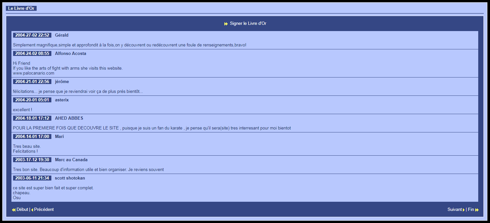

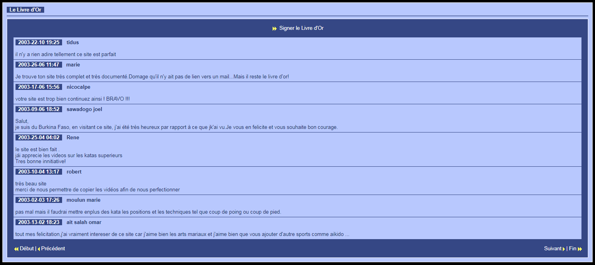

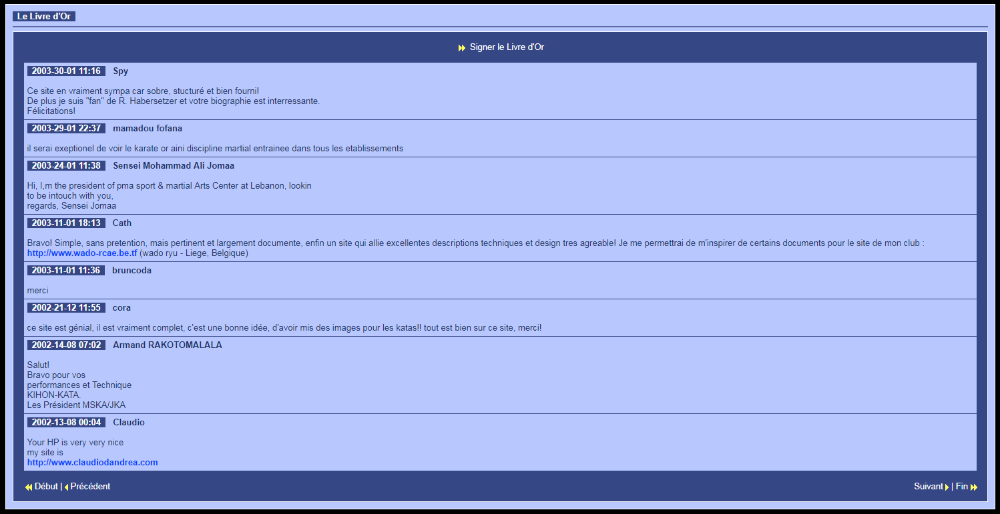

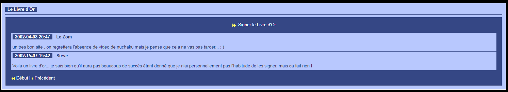